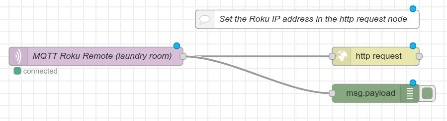

# ESP32 Roku Remote

Uses the [Roku External Control Protocol](https://developer.roku.com/docs/developer-program/debugging/external-control-api.md) (ECP) to issue commands over WiFi using an ESP32.

## WiFi Credentials

In created a file called `wificredentials.h` in this directory and place your SSID and password in it using the following format:

```
#define WIFISSID        "SSID"
#define WIFIPWD         "password"

```

## NodeRED version

The first iteration uses an MQTT server and NodeRED to receive messages from the ESP32 and issue the ECP command using an http request node. The advantage of this is that the IP address of the Roku device can be changed in NodeRED and doesn't require the ESP32 to be reflashed.

The NodeRED flow is included in this repo. Just import `roku-mqtt-remote-NodeRED-flow.json` into your NodeRED instance.



The `https request` node is where the base URL is stored. This needs to be changed to match the IP address of the Roku device you are trying to control.

 This was based on the [Roku Remote example flow](https://flows.nodered.org/flow/512ceba64ac94614558e4802c19c77aa) shared by ampherion.